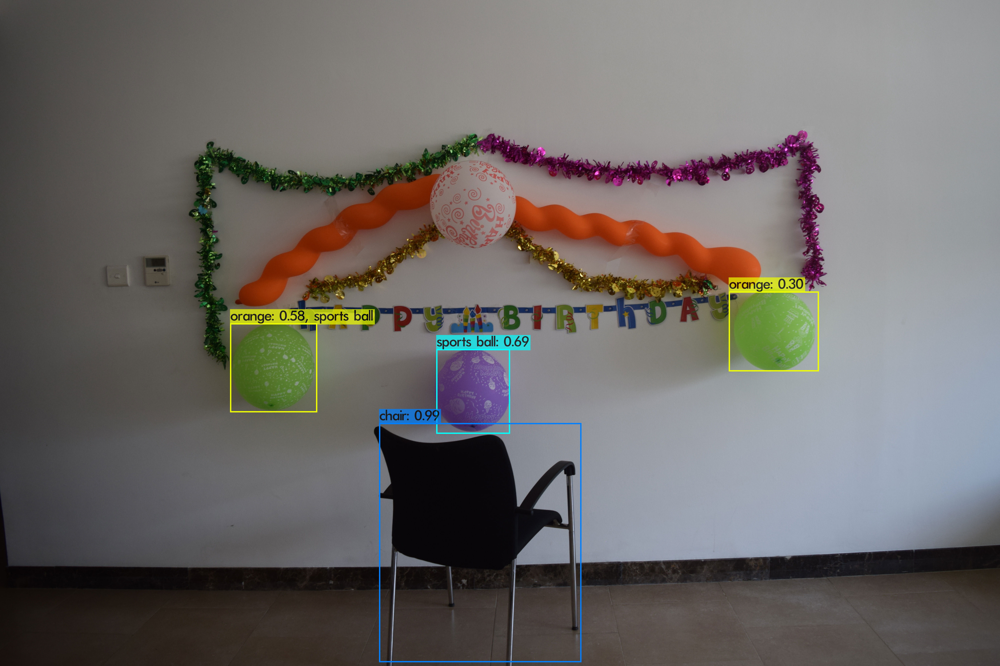
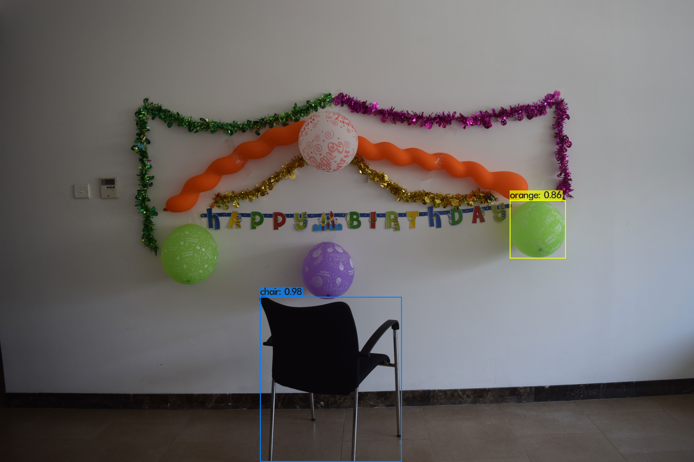
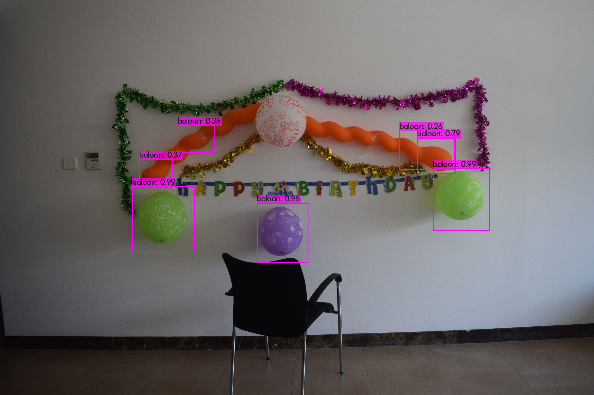

# Training yolov4 on custom dataset in Google Colab
I have trained yolov4 on my custom dataset to detect only 1 object which is baloon. Nevertheless, this document serves as a guide to train custom dataset on any number of objects. You can follow this by making changes in your number of objects(classes) accordingly. To start with, I tried yolov3 and yolov4 in the input image to see what it predicts.

Input image:

Prediction based on yolov3:

Prediction based on yolov4:

## Dataset Preparation
I collected 60 images for training, and labelled them using [Yolo_mark](https://github.com/AlexeyAB/Yolo_mark). Yolo_mark creates .txt file for each .jpg file in the same directory and with the same name. This labelled dataset is placed in a folder named `obj`. This folder should be placed under `data` folder in darknet which will be discussed further. I used a python script to extract the names of image files from `obj` folder and wrote it in `train.txt`. Each filename should be in new line, with path relative to darknet binary (i.e., data/obj). Example: If the obj folder contains 3 images named 1.jpg, 2.jpg, 3.jpg, then train.txt should contain: 
`
data/obj/1.jpg 
data/obj/2.jpg 
data/obj/3.jpg
`
Compresses the `obj` folder to `obj.tar.gz`

## Training Steps in Google Colab

* Make sure that GPU is enabled in Runtime of your notebook.

* Install darknet in the current session following these commands in the notebook:

`
!git clone https://github.com/AlexeyAB/darknet
%cd darknet
!sed -i 's/OPENCV=0/OPENCV=1/' Makefile
!sed -i 's/GPU=0/GPU=1/' Makefile
!sed -i 's/CUDNN=0/CUDNN=1/' Makefile
!sed -i 's/CUDNN_HALF=0/CUDNN_HALF=1/' Makefile
!make
`

* Download pre-trained `yolov4.conv.137 weights`:

`
!wget https://github.com/AlexeyAB/darknet/releases/download/darknet_yolo_v3_optimal/yolov4.conv.137
`

* Upload `obj.tar.gz` and `train.txt` to the current session

* Move `obj.tar.gz` inside `darknet` folder and run:

`
!tar -xvf obj.tar.gz -C data/
`

This will unzip obj.tar.gz inside data folder of darknet, such that the training images and labels are placed in `darknet/data/obj`

* Move `train.txt` inside `darknet/data`

* Follow step 1. in [https://github.com/AlexeyAB/darknet#how-to-train-to-detect-your-custom-objects](https://github.com/AlexeyAB/darknet#how-to-train-to-detect-your-custom-objects) to create `yolo-obj.cfg` in `darknet/cfg`. Here the number of classes is 1, as I am detecting only the baloon. Change the number of classes according to your requirement.

* Create file `obj.names` in the directory `darknet\data\`, with objects names - each in new line (baloon)

* Create file `obj.data` in the directory `darknet\data\`, containing (where classes = number of objects):

`
classes = 1
train  = data/train.txt
valid  = data/test.txt
names = data/obj.names
backup = backup/
`

* Create a copy of the `darket` folder in your drive, so that you need not execute the above training steps again in another session if your GPU runtime has exceeded

`from google.colab import drive
drive.mount('/content/drive')
`

`
!cp -r darknet drive/MyDrive/
`

* Start Training:

`
!./darknet detector train data/obj.data cfg/yolo-obj.cfg yolov4.conv.137 -dont_show
`

* Save the weights from `darknet/backup` folder to your drive to store it

* Unpload an input image and predict with trained weights:

`
!./darknet detector test data/obj.data cfg/yolo-obj.cfg backup/yolo-obj_1000.weights img1.JPG -dont_show
` 

